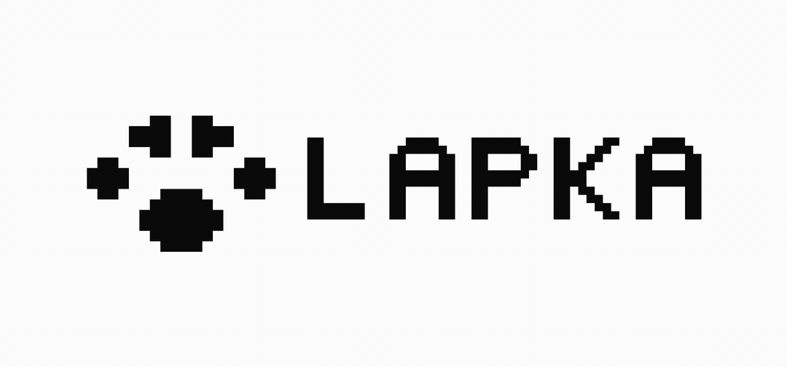
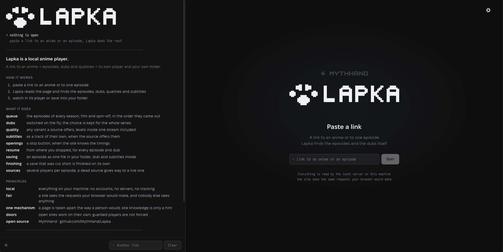
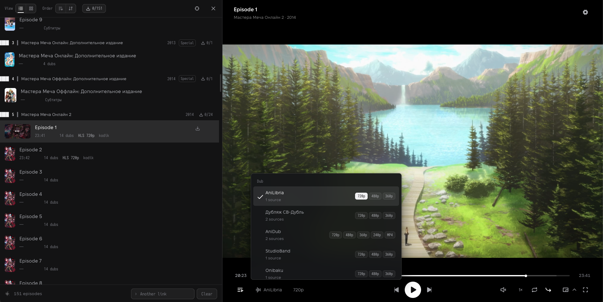
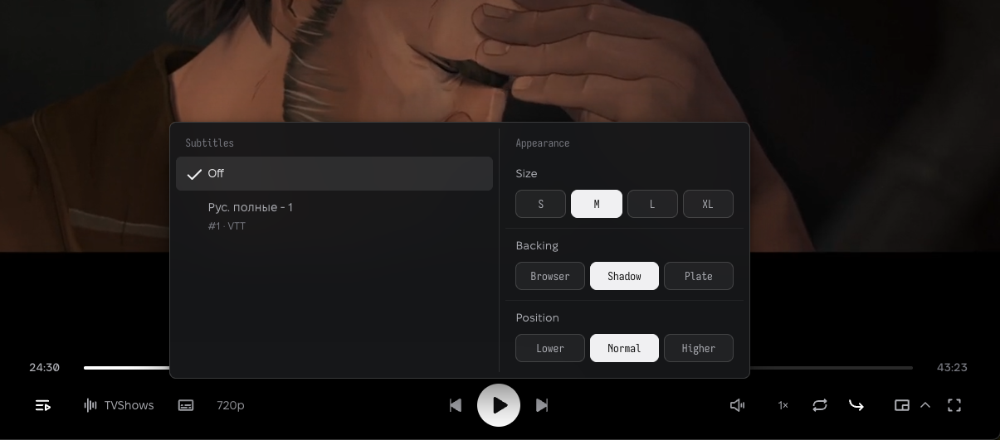
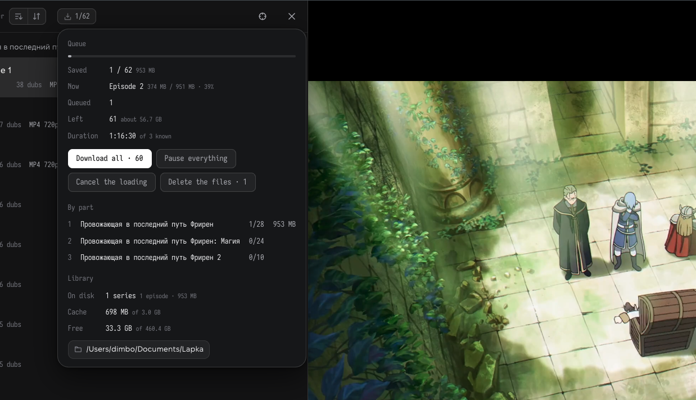
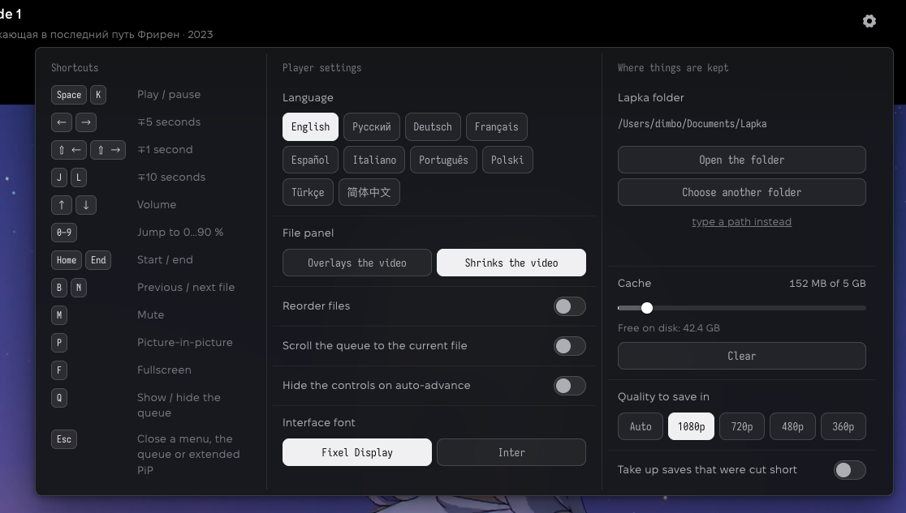
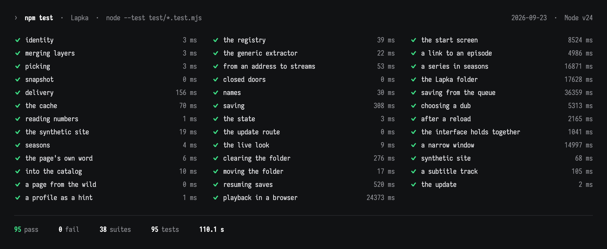

<p align="center">
  <picture>
    <source media="(prefers-color-scheme: dark)" srcset="docs/media/l_bl.gif">
    
  </picture>
</p>

# Lapka

English version: [README.md](README.md)

Локальный аниме-плеер. Вставляете ссылку на аниме или на одну серию, Lapka
читает страницу, находит серии, озвучки, качества и субтитры и показывает всё в
своём плеере. Серии идут одна за другой, выбранная озвучка держится на весь
сериал, любую серию можно сохранить одним файлом в свою папку.

Работает целиком на вашей машине: маленький сервер на Node.js читает страницы
сайта теми же запросами, что сделал бы ваш браузер, и отдаёт видео вашему
браузеру. Наружу ничего не проксируется, аккаунтов и библиотек в облаке нет.

Идея, дизайн и проверка руками: Dimbo. Код написан вместе с Claude в Claude Code.



Lapka выросла из [PIP-Player](https://github.com/MythHand/PIP-Player), локального
плеера того же автора под лицензией MIT. Его код переработан свободно и в составе
Lapka идёт под её лицензией; в исходном виде он остаётся доступен в репозитории
PIP-Player под MIT. Уведомление MIT сохранено в
[LICENSES/PIP-Player.MIT.txt](LICENSES/PIP-Player.MIT.txt).

## Что умеет

- **Очередь.** Серии всех сезонов, фильмов и спин-оффов франшизы в порядке выхода, даже когда
  сайт держит все сезоны в одном плеере.
- **Озвучки.** Переключение на ходу, без перезагрузки; выбор запоминается на весь сериал.
- **Качество.** Любой вариант источника, включая уровни внутри одного потока.
- **Субтитры.** Отдельной дорожкой, когда источник их отдаёт; вид субтитров настраивается.
- **Заставки.** Кнопка пропуска, если сайт знает тайминги; можно и автоматически, с шестью
  секундами на «смотреть».
- **Продолжение.** С того места, где остановились, для каждой серии и озвучки; досмотренная
  серия отмечается, на кадре видно, где остановились.
- **Сохранение.** Серия одним файлом в вашу папку, с выбранной озвучкой и субтитрами внутри.
  Загрузки идут очередью, одна за другой: пауза держит серию на достигнутом месте и продолжает
  оттуда, ожидающую можно сделать текущей, любую отменить, сохранённые файлы удалить из
  библиотеки прямо из плеера. Прерванное сохранение доделывается само. Качество для сохранения
  группы: максимальное, как в плеере или ближайшее к названному.
- **Источники.** Несколько плееров на серию; мёртвый источник меняется на живой сам.
- **Журнал.** Пока страница читается, разбор виден по шагам: что нашла, какие плееры открыла,
  какие части франшизы собрала.
- **Папка.** Сохранённые видео, заметки Lapka и кэш видны в настройках с размерами и чистятся
  каждое отдельно.
- **Обновление.** Из настроек: проверка версии на GitHub по кнопке, обновление и перезапуск
  самой Lapka, для папки-клона и для скачанного ZIP.
- **Отдельное окно.** Картинка в картинке, в том числе расширенная, с управлением прямо в окне.
- **Десять языков интерфейса.**



| Субтитры и их оформление | Окно загрузки очереди |
|---|---|
|  |  |

Механизм разбора страниц общий, а не написанный под конкретные сайты: Lapka ищет
плееры, списки серий и озвучек по устройству страницы. Проверено на:
aniliberty.top, old.yummyani.me, jut-su.net, animego.me, anidubonline.ru,
gogoanime.by, jkanime.net, newdeaf.co, yummyanime.tv, ani-media.online,
domanime.ru, lordserials.fan. Другие сайты с похожим устройством чаще всего
открываются тоже. Сайты с DRM и сайты, которые намеренно закрывают
свои плееры, Lapka не вскрывает.

## Запуск

Нужны [Node.js](https://nodejs.org/) 22 или новее (проверено на 24) и, только
для сохранения серий в файл, [ffmpeg](https://ffmpeg.org/) в PATH. Смотреть можно
и без ffmpeg.

```bash
git clone https://github.com/MythHand/Lapka.git
cd Lapka
npm install
npm start
```

Откройте http://127.0.0.1:8800 в браузере. Рекомендуется Chrome или Edge:
расширенное окно картинки в картинке есть только у них. Остановить сервер:
Ctrl+C в терминале.

Или без терминала: `start.command` на macOS и `start.bat` на Windows открываются
двойным кликом, `./start.sh` на Linux. Каждый проверяет Node.js, при первом запуске
ставит недостающее, поднимает Lapka в фоне и открывает её в браузере; это окно потом
можно закрыть, Lapka продолжает работать. Выключить: `stop.command`, `stop.bat` или
`./stop.sh`, либо кнопка «Выключить Lapka» в настройках (лапка в правом верхнем углу).
Обновить: в настройках строка «Версия» → «Проверить обновление» → «Обновить до v…»,
Lapka скачает, установит и перезапустится сама; или `update.command`, `update.bat`,
`./update.sh` (не второй `git clone`: git не пишет в существующую папку).



Файлы Lapka складываются в папку, которую вы выбираете в настройках
(шестерёнка → «Папка Lapka»). До первого выбора это `.dev/home` внутри папки
проекта. Переменная окружения `LAPKA_HOME` задаёт папку принудительно, `PORT`
меняет порт.

## Если вы не разработчик

Коротко: поставить Node.js с [nodejs.org](https://nodejs.org/) (кнопка LTS),
скачать этот проект (зелёная кнопка **Code** → **Download ZIP**), распаковать,
дважды кликнуть `start.command` (macOS) или `start.bat` (Windows). Браузер
откроет Lapka сам.

Подробно и по шагам для macOS, Windows и Linux, включая ffmpeg и типичные
ошибки: [docs/INSTALL.ru.md](docs/INSTALL.ru.md). Если ставите с помощью
ИИ-ассистента, дайте ему ссылку на этот файл: там всё, что нужно для точного
ответа.

## Разработка

Как запускать Lapka, сказано в двух разделах выше: «Запуск» это запуск
разработчика из клона (`git clone`, `npm install`, `npm start`), «Если вы не
разработчик» это установка из ZIP с лончером. Здесь ни то ни другое: здесь
инструменты для работы над кодом Lapka, для просмотра они не нужны.

- `npm run dev` — Lapka на 8800 и синтетический сайт для тестов на 8801: подставной
  «сайт с аниме» из `test/site`, на котором проверяется общий разбор страниц. Его
  клипы собирает ffmpeg; без него поднимется только Lapka.
  `SITE_SLOW_MS=3000 npm run site` замедляет отдачу файлов синтетического сайта, чтобы
  руками проверять паузу и очередь сохранений.
- `npm test` — все тесты. `npm run check` — статическая проверка фронта.
  Тесты реальных сайтов идут на снимках их страниц, которые хранятся вне репозитория;
  без них эти тесты честно помечают себя пропущенными.
- Карта ядра и контракты блоков: [core/README.ru.md](core/README.ru.md).



## Границы

Lapka нейтральна: это инструмент на вашей машине, который читает открытые
страницы вашими же запросами. Она не обходит DRM, не проксирует трафик наружу
и не хранит ничьи данные. Ответственность за то, что и где вы смотрите, на вас.

## Лицензия

Код Lapka распространяется под [GNU AGPL v3](LICENSE). Это значит: можно
использовать, изучать, менять и распространять, но производные версии, в том
числе работающие как сервис по сети, должны открывать свой код под той же
лицензией.

Это касается всего кода Lapka, включая переработанные части PIP-Player: берёте
код из Lapka, берёте его под AGPL; тот же код из репозитория PIP-Player берётся
оттуда под MIT. Имя Lapka, печать Lapka (лапа и надпись символами), имя и знак MythHand под
AGPL не попадают и вместе с кодом не раздаются, подробнее в
[TRADEMARKS.ru.md](TRADEMARKS.ru.md). Шрифты в `web/assets/fonts` идут под
SIL Open Font License.

© 2026 MythHand · Togulev Dmitry
